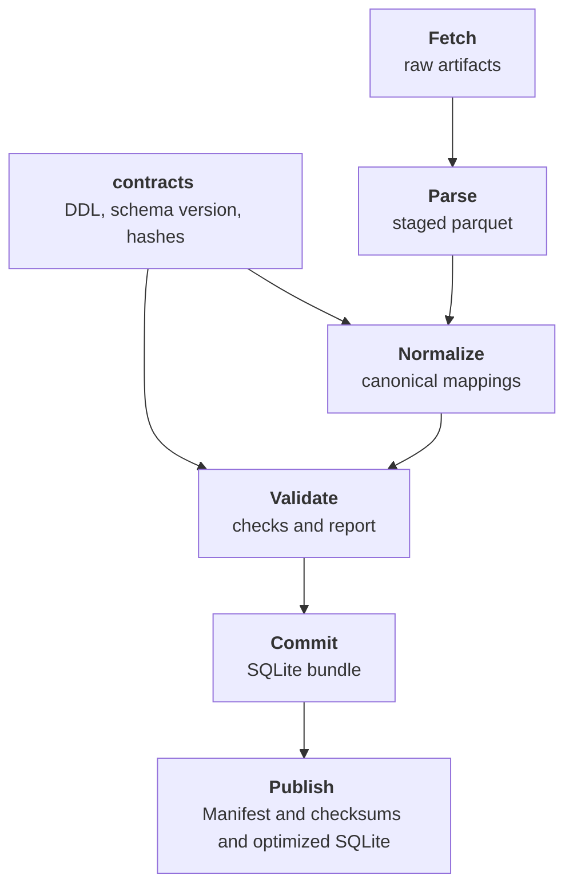

# Hong Kong Public Transport

**Not affiliated with the HKSAR Government or transport operators. Built for public-good use.**

This monorepo ingests Hong Kong transport open data from the HKSAR Government Data Portal ([data.gov.hk](https://data.gov.hk/en/)), normalizes it into a canonical schema, and publishes versioned SQLite artefact for downstream consumption.

## Running the pipeline
Prerequisites:
- Python 3.12+
- `uv`

```bash
# Execute full pipeline
uv run python -m hk_public_transport_etl.cli run

# You can also run specific pipeline stages (fetch, parse, normalize, validate, commit, publish)
uv run python -m hk_public_transport_etl.cli normalize

# Control headway inclusion
# Full (default): all headway tables
# Partial: pattern_headways and service_exceptions
# None: drop headway tables
uv run python -m hk_public_transport_etl.cli run --headway partial
```

Outputs are placed under `data/` (override via `HK_PUBLIC_TRANSPORT_DATA_ROOT`). 

## Commands
- `make format`: Run formatter

- `make format-check`:  Check formats

## Architecture


## License
MIT

### Data License

Refer to the Hong Kong DATA.GOV.HK [Terms & Condition](https://data.gov.hk/en/terms-and-conditions).
